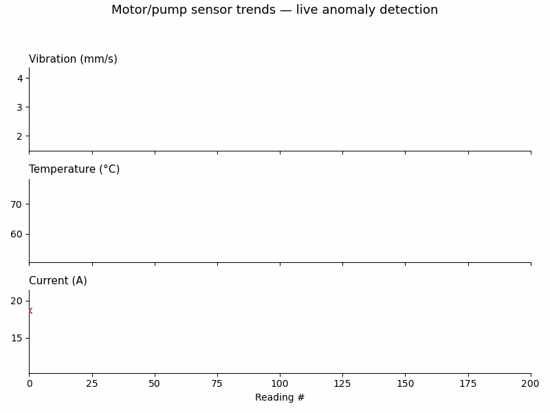
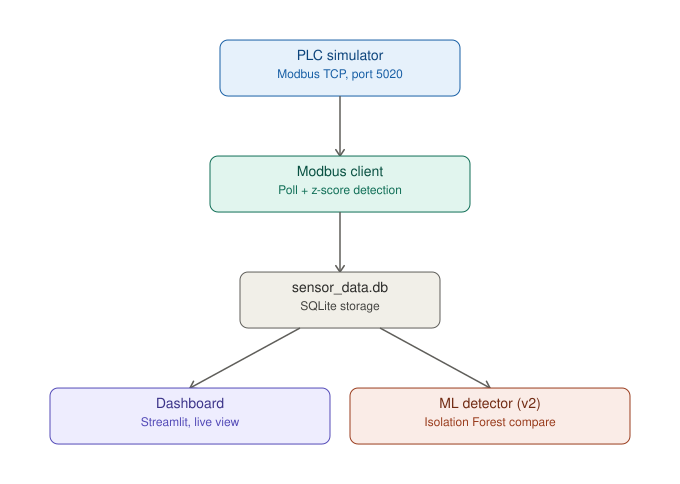

# Motor/Pump Predictive Maintenance Dashboard

A simulated end-to-end predictive maintenance pipeline for a motor/pump, built to
demonstrate the OT (PLC/Modbus) → IT (data/analytics/dashboard) bridge that
condition-based maintenance systems rely on in industry.

## Demo



*Live sensor trends (vibration, temperature, current) with red X markers showing
where the rolling z-score detector flagged an anomaly episode.*

## Problem statement

Unplanned motor/pump failures are expensive and often preceded by detectable
drift in vibration, temperature, or current draw. This project simulates that
scenario end-to-end: a PLC-equivalent device exposes live sensor data over
Modbus TCP, a client polls and analyzes it in real time, and a dashboard
surfaces the current health status the way a maintenance technician would want
to see it.

## Architecture



- **`plc_simulator.py`** — Stands in for a real PLC. Generates realistic
  vibration (mm/s), temperature (°C), and current (A) values with natural
  drift/noise, and occasionally injects anomaly episodes (vibration spike,
  overheating, current surge, or a combined "bearing wear" pattern). Exposes
  these as Modbus holding registers over TCP, exactly like a real
  Allen-Bradley/Siemens/Schneider PLC would.
- **`modbus_client.py`** — Polls the simulated PLC every 2 seconds, runs a
  rolling z-score anomaly detector per sensor, and logs every reading (value +
  anomaly flag + z-score) to a local SQLite database.
- **`dashboard.py`** — A Streamlit + Plotly dashboard that auto-refreshes,
  showing live trend charts per sensor with anomalies marked, current status
  (Normal / Warning / Alarm), and a table of recent anomaly events.

## Why a rolling z-score (and not a black-box model)?

The detector flags a reading as anomalous if it's more than 3 standard
deviations from the rolling mean of the last 30 readings, per sensor. This is
intentionally simple and fully explainable — in a maintenance/engineering
context, being able to say exactly *why* something was flagged matters more
than squeezing out marginal accuracy with an opaque model. The code is
structured so a more advanced model (e.g. Isolation Forest) could be swapped
in as a documented "v2" without changing the rest of the pipeline.

**Note on baseline "burn-in":** like a real condition-monitoring system
commissioned on a machine, the detector needs a clean baseline period before
it can reliably flag anomalies — this is why the simulator holds off on
injecting anomalies for the first ~40 seconds after startup.

## Running it (3 terminals)

```bash
pip install -r requirements.txt

# Terminal 1 — simulated PLC
python plc_simulator.py

# Terminal 2 — data acquisition + anomaly detection
python modbus_client.py

# Terminal 3 — dashboard
streamlit run dashboard.py
```

Then open the URL Streamlit prints (usually `http://localhost:8501`).

## v2: Isolation Forest comparison (`ml_anomaly_detector.py`)

After collecting a few minutes of data with the pipeline above, run:

```bash
python ml_anomaly_detector.py
```

This trains a multivariate Isolation Forest on the collected readings and
compares its anomaly calls against the rolling z-score detector — printing
where they agree, where each one catches something the other misses, and
saving a full comparison to `ml_comparison_results.csv`. The two methods
disagreeing on some readings isn't a bug: the z-score detector looks at each
sensor independently, while Isolation Forest can catch unusual *combinations*
across sensors (like the simulator's "bearing wear" pattern, which nudges all
three sensors slightly rather than spiking one). That trade-off — simple and
explainable vs. multivariate but harder to interpret — is worth being able to
talk through in an interview.

## Methodology

| Stage | Method | Key parameters |
|---|---|---|
| Data acquisition | Modbus TCP polling | 2s poll interval, 4 holding registers (vibration, temperature, current, PLC health) |
| Baseline detector | Rolling z-score, per sensor | 30-sample rolling window, flag if \|z\| > 3.0, 10-sample minimum before flagging |
| Commissioning | Burn-in period | No anomalies injected for first 20 ticks (~40s) so the baseline settles cleanly |
| v2 detector | Isolation Forest (unsupervised) | 200 estimators, contamination = 0.1, trained on vibration + temperature + current jointly |
| Evaluation | Agreement analysis | Compares z-score vs. Isolation Forest flags: both / z-only / ML-only / neither |

## Results

*(Numbers below are from a sample run — replace with your own after running the pipeline for a few minutes; `ml_anomaly_detector.py` prints these automatically.)*

| Metric | Example value |
|---|---|
| Total readings analyzed | 75 |
| Anomalies flagged by z-score | 8 |
| Flagged by both z-score and Isolation Forest | 5 |
| Flagged by z-score only | 3 |
| Flagged by Isolation Forest only | 3 |

The disagreement between methods is the interesting result here, not a flaw:
the z-score detector catches sharp single-sensor spikes reliably, while
Isolation Forest is better positioned to catch the "bearing wear" pattern,
where all three sensors shift only slightly but *together* in a way no single
sensor's threshold would flag on its own.

## What I'd do differently at production scale

- Swap SQLite for a real time-series database (InfluxDB or TimescaleDB)
- Swap Streamlit for Grafana, fed by InfluxDB, for a more "control-room" feel
- Replace the simulated PLC with OpenPLC running actual ladder logic, or a
  real PLC over Modbus RTU/TCP
- Add alerting (email/SMS/Teams webhook) on sustained anomalies

## Tech stack

Python · pymodbus (Modbus TCP) · SQLite · pandas · Streamlit · Plotly
